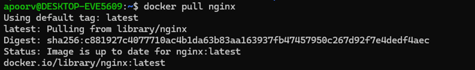
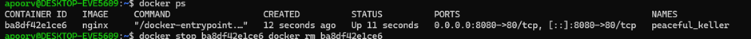
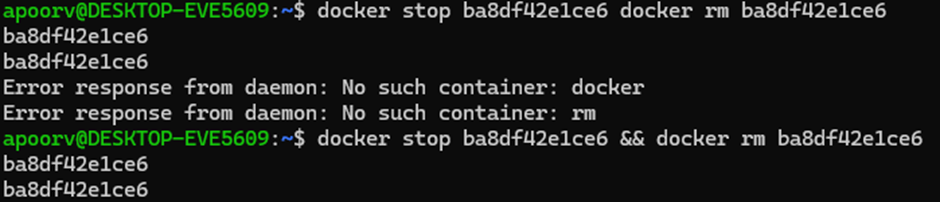
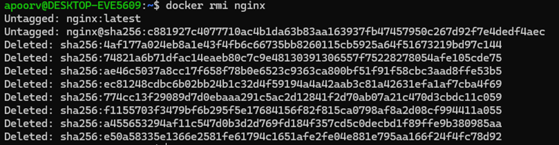

# Experiment 2

## Title
Docker installation, configuration and running images 

---

## Objective
To pull docker images, run containers and manage the container lifecycle 

---


## Theory

Virtual Machine (VM) and Container are two different approaches to virtualization.

A Virtual Machine provides hardware-level virtualization and runs a complete operating system. Each VM includes its own OS, libraries, and dependencies. Due to this, Virtual Machines consume more CPU, memory, and storage resources. VM startup time is also higher.

Containers provide operating system-level virtualization. Containers share the host operating system kernel and only package the application with its dependencies. This makes containers lightweight, faster, and more resource-efficient.

In this experiment, a Virtual Machine is created using VirtualBox and Vagrant, and Nginx is installed inside it. Later, the same service is deployed using Docker containers. Resource usage is compared to determine which approach performs better.


## Procedure

#### Step 1: Pull image
```bash 
docker pull nginx
```



---

#### Step 2: Run container with port mapping
```bash 
docker run -d -p 8080:80 nginx
```


---

#### Step 3: Verify Running containers

```bash
docker ps
```

#### Step 4: Stop and remove container 

```bash
docker stop <container_id>
docker rm <container_id>
```



#### Step 5: Remove image
```bash
docker rmi nginx
```



### Commands Used
```bash
docker pull nginx
docker run -d -p 8080:80 --name nginx-container nginx
docker ps
docker stop <container_id> && docker rm <container_id>
docker rmi nginx
```

### Result
Docker images were successfully pulled, containers executed and lifecycle commands performed. 

### Overall Conclusion

This lab demonstrated virtualization using Vagrant + VirtualBox and containerization using Docker, highlighting clear performance and resource efficiency differences. Containers are better suited for
rapid deployment and microservices, while VMs provide stronger isolation.