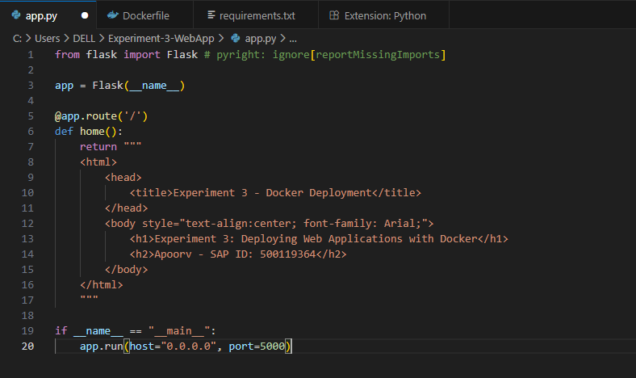
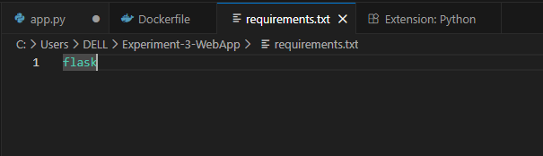
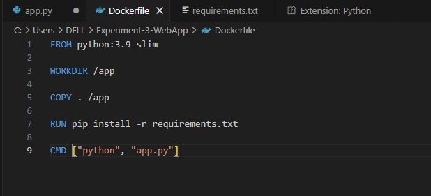
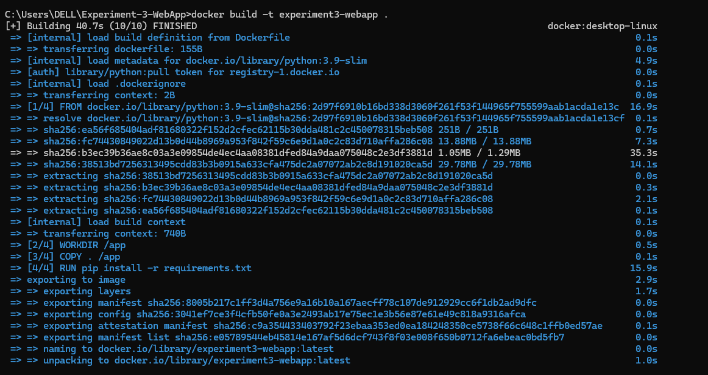
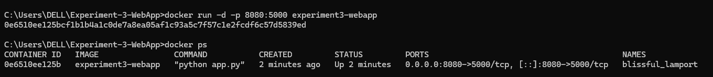
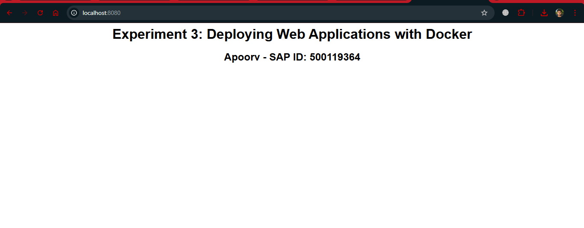
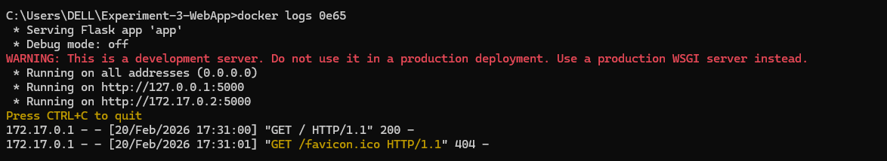
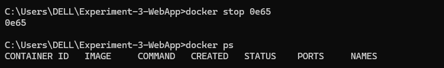

# Experiment 3

## Title: 
Deploying Web Applications with Docker

---

## Objective
This experiment demonstrates how to deploy a simple web application using Docker.  
A Flask-based web app is containerized using a Dockerfile, built into an image, and deployed inside a running container.

---

## Web Application Details

The application displays the following information:

- **Apoorv – SAP ID: 500119364**


---

## Technologies Used

- Python Flask
- Docker
- Windows Terminal

---


##  Procedure 

---

### Step 1: Create Project Folder

```bash
mkdir Experiment-3-WebApp
cd Experiment-3-WebApp
```


### Step 2: Create Flask App (app.py)
```bash
from flask import Flask

app = Flask(__name__)

@app.route('/')
def home():
    return """
    <h1>Experiment 3: Deploying Web Applications with Docker</h1>
    <h2>Apoorv - SAP ID: 500119364</h2>
    
    """

if __name__ == "__main__":
    app.run(host="0.0.0.0", port=5000)
```



### Step 3: Add Requirements File
```bash
flask
```

Create requirements.txt


### Step 4: Write Dockerfile
```bash
FROM python:3.9-slim

WORKDIR /app

COPY . /app

RUN pip install -r requirements.txt

CMD ["python", "app.py"]
```


### Step 5: Build Docker Image
```bash
docker build -t experiment3-webapp .
```


### Step 6: Run Docker Container
```bash
docker run -d -p 8080:5000 experiment3-webapp
```




### Step 7: Verify Deployment

Open browser:

http://localhost:8080




### Step 8: Check Logs
```bash
docker logs <container-id>
```



### Step 9: Stop the container
```bash
docker stop 7b78
1d3ca2ae
```



## Result

The Flask web application was successfully containerized and deployed using Docker.
It ran correctly inside a Docker container and was accessible through a web browser.

## Conclusion

Containerizing web applications ensures portability, consistency, and ease of deployment across environments.
Docker makes it simple to package and run applications anywhere without dependency issues.